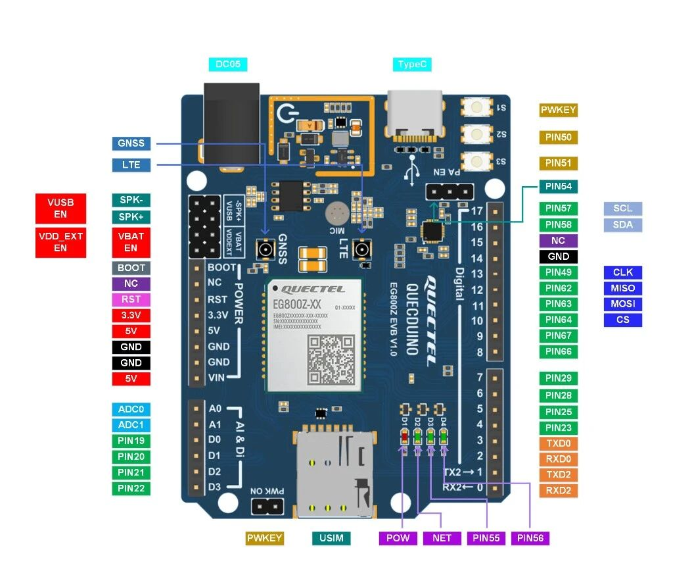
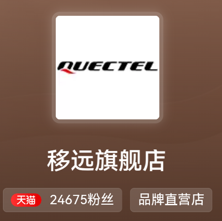

# unirtos-dev skill

UniRTOS（移远统一 C 语言嵌入式 SDK）设备开发与运维技能，供 ZCode 等 AI Agent 使用。
姊妹技能：[quecpython-dev-skill](https://github.com/LiteChipCloud/quecpython-dev-skill)（QuecPython 侧）。

## 能力范围

- **工程开发**：unirtos-cli 工程（new / env-setup / build / menuconfig）、env_config.json、CMake 变体
- **模组与开发板**：EG800ZCN / EC800Z / EG915Z；EG800Z QuecDuino EVB 等参考板
- **C API**：qosa_ / qcm_ / qurl_（任务、队列、MQTT、HTTPS/TLS、nvitem KVS、VFS、ADC/PWM/GPIO）
- **烧录与调试**：QFlash / .hbinpkg、QCOM AT、EPAT 日志、AT+QDOWNLOAD
- **实战沉淀**：蜂窝拨号 APN 轮换、TLS1.2+SNI+CA 锚定、Lua 5.4.7 协程集成、技能热更新协议等踩坑实录（references/）

## 目录结构

| 路径 | 说明 |
|---|---|
| `SKILL.md` | 技能入口与触发规则 |
| `references/` | 深度参考：API 摘要、烧录流程、疑难排查（troubleshooting.md 含 30+ 实测坑） |
| `assets/templates/` | 工程模板（CMakeLists / main.c / MQTT 上行 / 拨号） |
| `assets/*.txt` | qosa 头文件索引、SDK 文件树 |
| `scripts/` | 烧录/上传辅助脚本 |
| `CHANGELOG.md` | 版本历史 |

## 文档镜像（本地补齐）

`assets/docs-md/` 是移远官方文档的本地镜像（FAQ、UniRTOS 概述等，约 2MB / 130+ 篇）。
因文档版权为 Quectel 所有，**不入本仓库**。本地使用时请从移远官方文档站同步：

```
https://www.quectel.com.cn/document/   （UniRTOS / QuecOpen 板块）
```

镜像缺失时技能仍可用（SKILL.md 与 references/ 自包含），仅离线查文档能力降级。

## 开发验证硬件参考（移远官方旗舰店）

本 Skill 面向 UniRTOS 模组开发（EG800Z / EC800Z / EG915Z 等系），与具体板卡解耦。开发验证常用的 EG800Z QuecDuino EVB 等开发板及配套模组，可在淘宝「移远官方旗舰店」（天猫品牌直营店）购买：

<p align="center">
  &nbsp;&nbsp;
</p>

- 开发验证参考板：EG800Z QuecDuino EVB（板图来源：移远官方社区）
- 购买渠道：淘宝 App 搜索「移远官方旗舰店」
- 说明：仅作为开发验证硬件参考，不构成唯一采购渠道；Skill 流程对其他 UniRTOS 模组同样适用

## 官方资源（UniRTOS）

| 资源 | 链接 |
|---|---|
| UniRTOS 文档首页 | <https://docs.quectel.com/zh/UniRTOS/UniRTOS文档/index.html> |
| UniRTOS 文档站（中文门户） | <https://www.quectel.com.cn/unirtos/docs> |
| 开发者社区（UniRTOS 板块） | <https://forumschinese.quectel.com/c/66-category/66> |

> 注：UniRTOS SDK 以 Quectel Custom Source License 随开发板 / 工具链分发，无公开开源组织首页；生态入口以上述官方文档站与开发者社区为准。

## License

技能本体（SKILL.md / references / scripts / templates）以 [Apache-2.0](LICENSE) 发布。
`assets/docs-md/` 若本地存在，版权归属 Quectel，不得再分发。

---

## 相关项目：LiteGate CLI

[LiteGate](https://github.com/LiteChipCloud/litegate) 是一站式大模型 API 网关：一个 Key 通吃 Claude / GLM / DeepSeek / MiniMax / Qwen 等 14 款模型，OpenAI 与 Claude 双协议兼容，长期免费模型，全线 1M 上下文。官方 CLI 一条命令即可把 Claude Code / Codex / ZCode / MiniMax Code 等 AI 编程工具全部接上 LiteGate：

```bash
# 零安装直接用
npx @litechipcloud/litegate init
```

安装即用：检测本机 AI 编程工具 → 粘贴 Key → 自动写入配置（增量模式不碰已有配置，自动备份可回滚）。详见 [LiteChipCloud/litegate](https://github.com/LiteChipCloud/litegate)。
