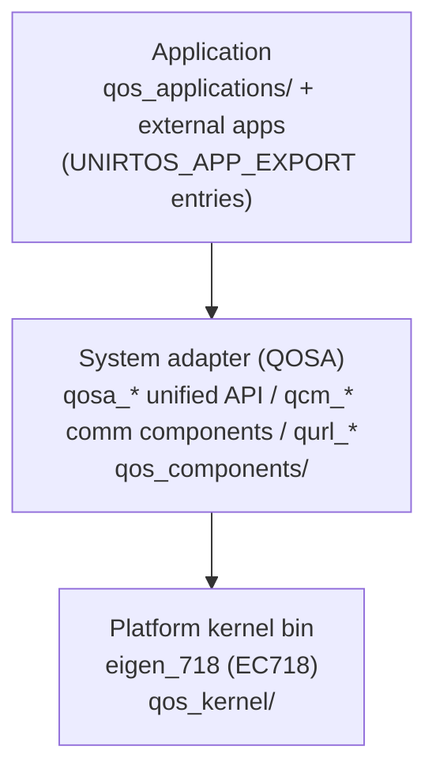

# UniRTOS Core Rules

Mandatory baseline for all UniRTOS device-side code. Sources: official SDK README_zh, `qos_applications/app_init/` source, official docs (see `assets/docs-md/`).

## 1. Platform identity

| Item | Value |
| --- | --- |
| Nature | Quectel unified C-language embedded SDK (开发框架), NOT a Python runtime |
| Kernel | FreeRTOS-based, deep memory/scheduler optimization; delivered as kernel bin per platform |
| Current platform | `eigen_718` (EigenComm EC718 chipset) |
| Supported modules | EC800Z-CN, EG800Z-EU, EG800Z-CN, EG800Z-LA, EG800Z-GL, EG915Z-EU |
| Memory budget | RAM 4/8 MB total → **~1024 KB usable RAM**; FLASH 4/8 MB total → **~800 KB usable flash** |
| License | "Quectel Custom Source License for UniRTOS" — custom terms, not standard OSS; review before redistributing SDK code |

Architecture (3 layers):



The app layer never touches the kernel directly — all platform capability arrives through the unified QOSA/QCM/QURL interfaces.

## 2. App entry contract (UNIRTOS_APP_EXPORT)

Defined in `qos_applications/app_init/unirtos_app_init_registry.h`:

```c
typedef void (*unirtos_app_init_fn_t)(void);
#define UNIRTOS_APP_EXPORT(order_value, entry_name, entry_fn) ...
```

Rules:
1. Every external application registers exactly one (or more, for multi-app projects) init function:
   `UNIRTOS_APP_EXPORT(700, "unir_hello_world_demo", unir_hello_world_init);`
2. Registration uses a GCC linker section (`.unirtos_app_init`); entries are **sorted by `order_value` ascending** at runtime and invoked sequentially by `apps_init()`. Use distinct order values when apps have dependencies; the built-in demo uses `700`.
3. Init functions must NOT block: create a task (and optionally a msgq) and return. Long-running logic belongs in the task loop.
4. Entry names must be valid C identifiers; the string name appears in boot logs (`app init: <name>`) — keep it descriptive.

Standard app skeleton invariants:
- `#include` order: `qosa_def.h`, `qosa_sys.h`, `qosa_log.h`, then `unirtos_app_init_registry.h`.
- Define `QOS_LOG_TAG` before including log usage.
- Always explicit task stack size (bytes) and priority (`QOSA_PRIORITY_NORMAL` default; higher number = higher priority).

## 3. Coding constraints

1. Pure C, GCC-compatible. App sources under `main/src/*.c`, headers under `main/inc/` (template CMake auto-globs both).
2. QOSA types only in device code: `qosa_uint8_t`, `qosa_int32_t`, `qosa_task_t`, `qosa_bool_t` (`QOSA_TRUE/QOSA_FALSE`), `QOSA_NULL`.
3. Return-code convention: `QOSA_OK (0)` on success; negative/`QOSA_ERROR_*` codes otherwise; peripherals return module-specific enums (`QOSA_UART_SUCCESS`, `QOSA_GPIO_SUCCESS` ...). Always check and log return codes with `QLOG*`.
4. Logging: `QLOGV/QLOGD/QLOGI/QLOGW/QLOGE` (qosa_log.h). Tag via `#define QOS_LOG_TAG`. These surface in EPAT via the build's `comdb.txt`.
5. Task sleep: `qosa_task_sleep_ms(ms)` / `qosa_task_sleep_sec(sec)` — never busy-wait loops.
6. ISR/callback context: event callbacks (DataCall, MQTT, UART cb) run in SDK context — do not call blocking APIs inside them; hand work to a queue (`qosa_msgq_*`) and process in a task.
7. Stack sizing guidance from official demos: LED/GPIO demo 1 KB; DataCall/network demo 4 KB; MQTT/TLS give headroom (≥6 KB) and verify with stack-high-water stats when available.
8. Blocking network operations (`qosa_datacall_start`, `qcm_mqtt_client_connect`) belong in dedicated network tasks, never in init functions or callbacks.

## 4. Memory & resource discipline

1. Static allocation first: `qosa_task_create_static` where a fixed stack/TCB is acceptable.
2. Count your RAM: 1024 KB usable is shared by kernel + SDK + all tasks + network buffers. A single over-sized task stack can starve the system.
3. Flash budget 800 KB usable: trim via `unirtos-cli menuconfig` (Kconfig) — disable unused components (camera, audio, GNSS...) before release builds.
4. Every `qosa_*_create`/`*_open` must have a matching delete/close path or a documented owner that lives for the whole run.

## 5. Versioning conventions

| Artifact | Example | Notes |
| --- | --- | --- |
| SDK version | `1.0.5` | env_config `sdk.version`; mapped to git tag `v1.0.5` |
| unirtos-cli | `1.0.20` (PyPI latest) | docs baseline: ≥1.0.15; keep current via `pip install -U unirtos-cli` |
| Toolchain (`unirtos`) | `1.0.5`+ | installed by `unirtos-toolchain.exe`, default dir `D:\unirtos-toolchain` (~4.3 GB) |
| Firmware version string | `EG800ZCNLAR01A01_OCPU_20260625` | set via `build -v` / `env_config.build.version`; becomes the output folder name under `qos_build/release/` |

Pattern of the firmware string: `<MODULE><RxxAxx[_BETA]>_<SKU>_<YYYYMMDD>` — keep it stable per release for traceability in logs and QFlash records.

## 6. Safety rules (this machine)

1. Two devices exist locally. The **remote switch device (EC800K + QuecPython, seen on COM67–COM70 on 2026-09-10)** must never be flashed, reset, or written. It answers `ATI` with `EC800K ... _QPY`.
2. Before any write action (QFlash, fota, AT+CFUN, reset) on any port, identify the module first (`scripts/unirtos_com_probe.py --identify COMx`) and require an EG800Z/EC800Z/EG915Z family model string.
3. USB VID/PID `2C7C:6002` is shared across Quectel EC7xx-family modules — VID/PID alone does NOT identify the model; always rely on ATI response.
